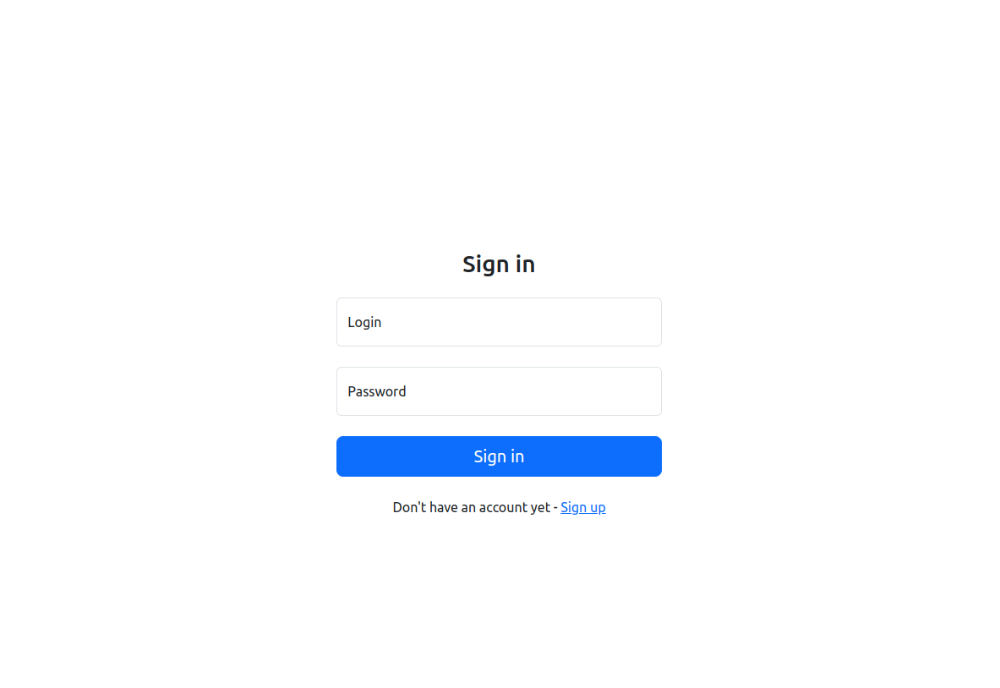
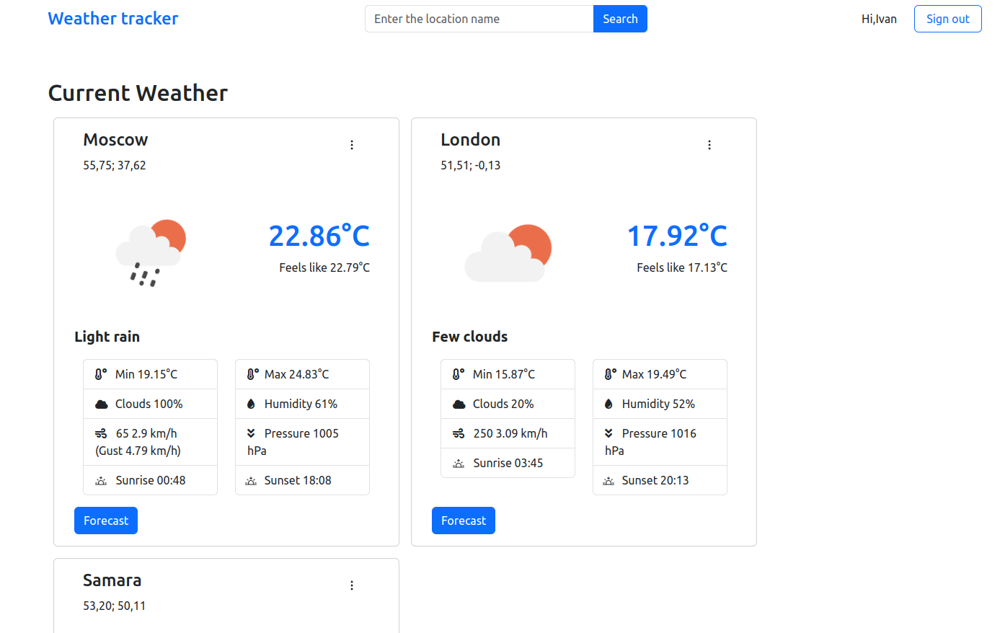
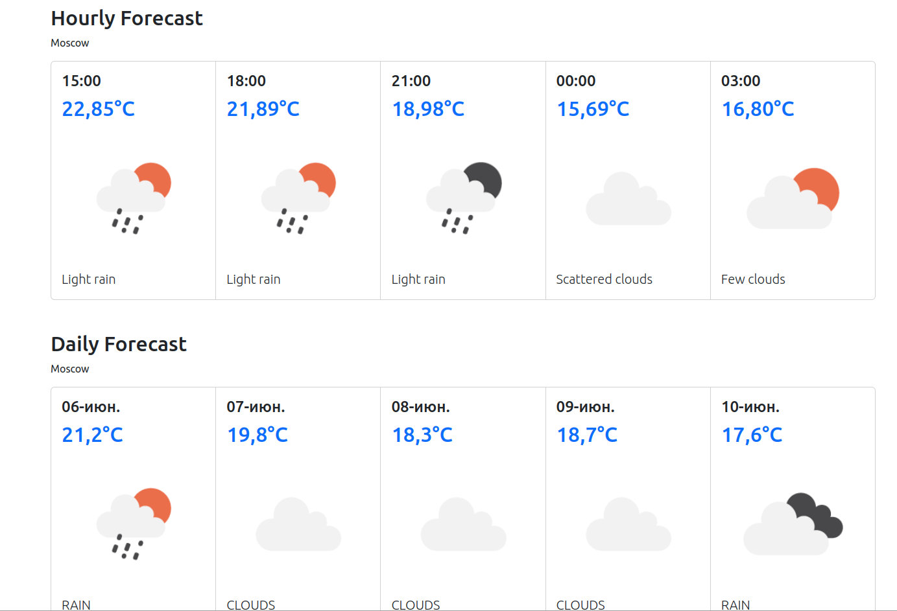

# Погода
## Содержание
- [Описание](#desc)
- [Технологический стек](#frameworks)
- [Деплой](#deploy)
- [Как запустить локально](#run)
- [Дизайн](#design)

<a name="desc"></a>
## Описание
Веб-приложение для просмотра погоды.
Пользователь может зарегистрироваться и добавить в коллекцию одну или несколько локаций (городов, сёл, других населённых пунктов), после чего главная страница приложения начинает отображать список локаций с их текущей погодой.
Можно узнать прогноз погоды для конкретной локации на несколько часов или дней.

Данные прогноза запрашиваются у сервиса OpenWeatherMap (https://openweathermap.org/) по API.

<a name="frameworks"></a>
## Технологический стек
- Java
- Gradle
- Spring Framework (MVC, Data)
- Tomcat
- Thymeleaf
- PostgreSQL
- Flyway
- Lombok
- Jackson
- Mapstruct

<a name="deploy"></a>
## Деплой
Приложение доступно по адресу http://213.226.126.69:8082/weather-viewer-1.0.

<a name="run"></a>
## Как запустить локально
1. Установите переменные OPEN_WEATHER_KEY и API_PORT в .env файле.
2. Запустите контейнер с приложением:
```
docker compose up -d
```
Приложение будет доступно по адресу http://localhost:API_PORT/weather-viewer-1.0/

<a name="design"></a>
## Дизайн




